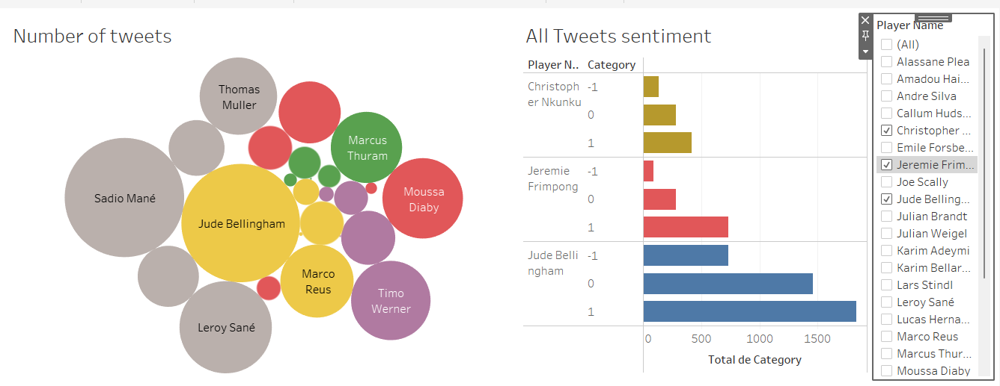
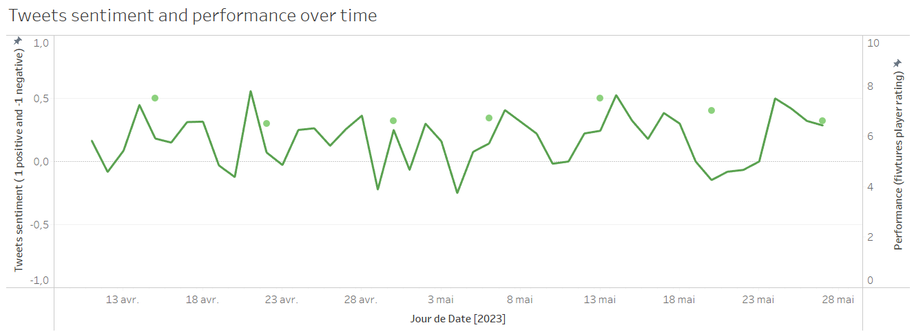
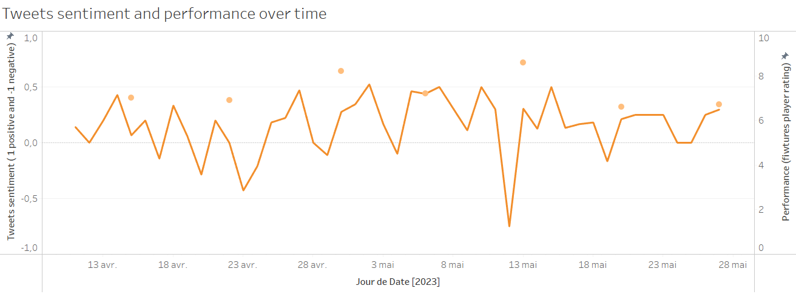

# twitter_player_performance
## Overview
This project aims to develop an application that analyzes the correlation between football player performance and public sentiment on Twitter. The project focuses on 5 Bundesliga teams and 5 players from each team. The application collects daily tweets where one of the players was tagged and Bundesliga match stats, including the players' ratings in these matches.

The app is developed in Python and gathers tweets by querying the Twitter API. It also gathers players' ratings during matches by querying a football-API (RapidAPI). The raw data is stored in a data lake, which is a Hadoop Distributed File System (HDFS) cluster with 3 data nodes. The data is stored in a serialized form with Avro files. The data is loaded to the data lake in daily batches, with one Avro file per batch.

After the data is loaded into the data lake, a consolidation step is performed where unprocessed batches in the data lake are checked, data is extracted, and analyzed. This analysis involves applying a machine learning algorithm for sentiment analysis. This algorithm assigns a score for every tweet based on whether the tweet is negative or positive about the player. The analyzed tweet data, along with the players' ratings, is then loaded into the data warehouse.

The Data Warehouse is a MongoDB non relational database along side a Postgres relational database that serves as backup. In the end, Tableau is connected to the Data Warehouse in order to visualize the data and analyze the correlation between players' ratings and the public tweets about them.
## Technologies
* Python
* Twitter API
* Football-API (RapidAPI)
* Hadoop Distributed File System (HDFS)
* Avro
* Machine Learning Algorithms
* Postgres
* MongoDB
* Tableau

## Data Collection
The project collects data from two sources: Twitter and a football-API. To collect data from Twitter, we use the Twitter API to search for tweets where one of the players was tagged. We then extract relevant information such as the tweet text, user information, and creation time.

To collect data from the football-API, we use RapidAPI to access data on Bundesliga matches, including the players' ratings in these matches.

Both sets of data are then stored in the data lake in serialized form using Avro files.

## Data Processing
The data collected from Twitter and the football-API is processed through a machine learning algorithm for sentiment analysis. The sentiment analysis algorithm analyzes the tweet data and assigns a score to each tweet based on whether the tweet is positive or negative about the player.

Once the data has been analyzed, it is loaded into the data warehouse in a relational database format. The data warehouse is a Postgres database with well-defined tables that are optimized for data analysis.

## Data Analysis
Tableau is used to connect to the Postgres database and visualize the data. The goal is to analyze the correlation between players' ratings and public sentiment on Twitter. By visualizing the data, we can identify patterns and trends that may provide insights into how public sentiment affects player performance.

## Conclusion
Although the data we managed to collect is limited, we still tried to draw some conclusions (that of course may not be 100% true) from our dashboard that you can see in the following. Before diving into these few examples, I must state that the data collected is very limited by the twitter API which for sure biased our conclusions. I also must add that the conclusions stated are only taking into account the social media factor, however the analysis of a player performance is far more complex than this and there are more factors to it.
#### Jude Bellingham:

We can see that in the case of Jude Bellingham there is no correlation between the sentiments of the tweets about him and his performance. We can say that this player has a strong character and is not influenced by social media.
#### Thomas Muller:

From this example, we can see that the tweets sentiment fluctuates around a date pf a match. Which can be interpreted as the player's performance that influences the tweets sentiment and not the opposite. We can see that a day before the match the tweets sentiment usually gets better, this could be due to the match day hype. We also see that there are peaks a day after the match, whether the tweets sentiment gets lower after a low performance or better after a good performance. 
#### Serge Gnabry:

In this player's case, we see that the tweets sentiment a day before a match may influence his match performance. We noticed that when the tweet's sentiment is rising before a match day, the player's performance is low, but when the sentiment is low, the player performs better during the match. This means that the player performs better under the pressure of the fans in social media.
## Credits
This project was developed by Dbira Moez
